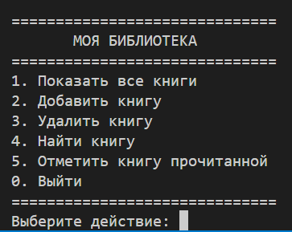

# 📚 Personal Library

Простое консольное приложение на Python для управления личной библиотекой книг.

Проект создан в учебных целях для практики Python, работы с JSON, Git и GitHub.

## 🖥️ Скриншот


## ✨ Возможности

- 📚 Просмотр всех книг
- ➕ Добавление новых книг
- 🗑️ Удаление книг
- 🔎 Поиск книг по названию
- ✅ Отметка книги как прочитанной
- 💾 Автоматическое сохранение данных в JSON

## 🛠️ Технологии

- Python 3
- JSON
- Git
- GitHub

## 📂 Структура проекта

```text
personal-library/
│
├── main.py        # Основной файл программы
├── library.py     # Работа с файлами и данными
├── books.json     # База данных книг
├── README.md      # Описание проекта
└── .gitignore     # Файлы, которые не загружаются на GitHub